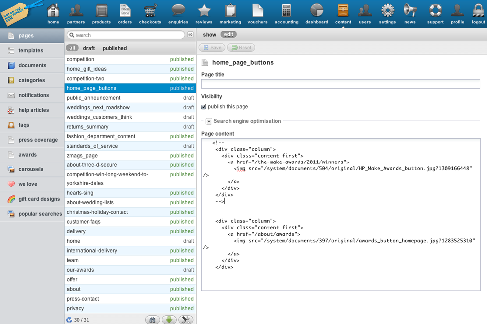
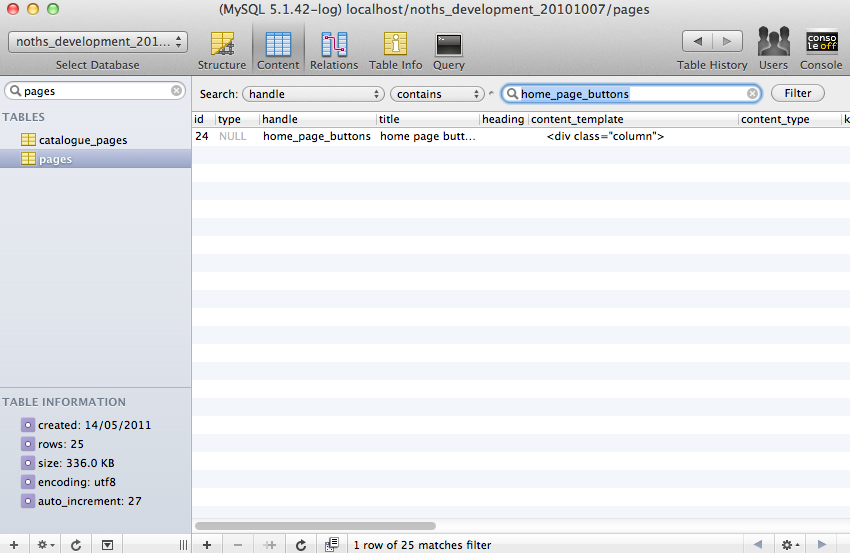
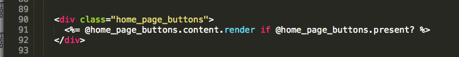
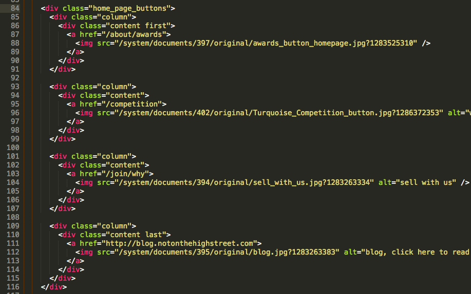

<!SLIDE title-slide>
.notes run through what im going to talk about

# Pages #

!SLIDE center full-page
.notes show page in browser

!SLIDE center full-page
.notes show page in browser

!SLIDE center full-page
.notes show page in browser

!SLIDE center full-page
.notes show page in browser

!SLIDE full-page center
.notes controller like air traffic controller

# Quick runthrough #

!SLIDE smaller
.notes controller like air traffic controller
# Controller #
	@@@ ruby
	def home_page
      @home_page_buttons = Database.find 'home_page_buttons'
	end

!SLIDE center full-page
.notes show page in browser

!SLIDE center full-page
.notes show page in browser

!SLIDE center full-page
.notes show page in browser

