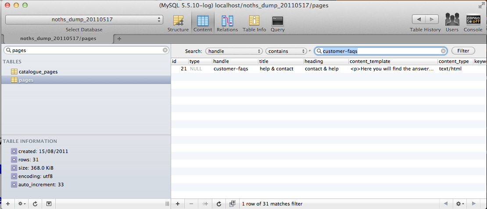
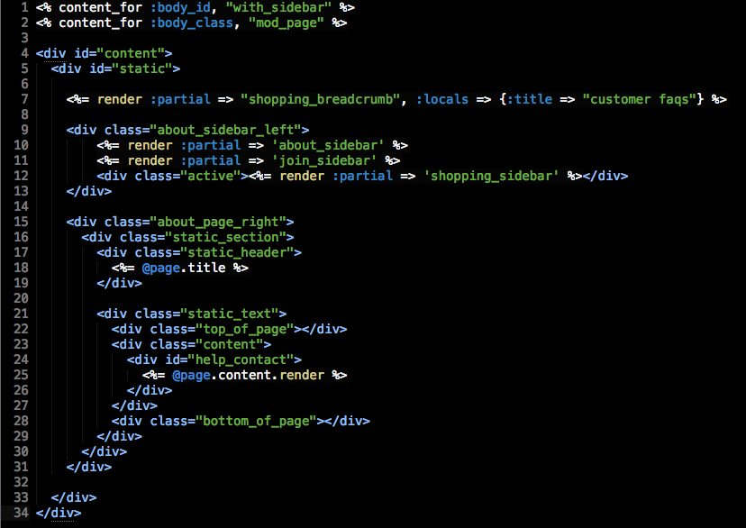
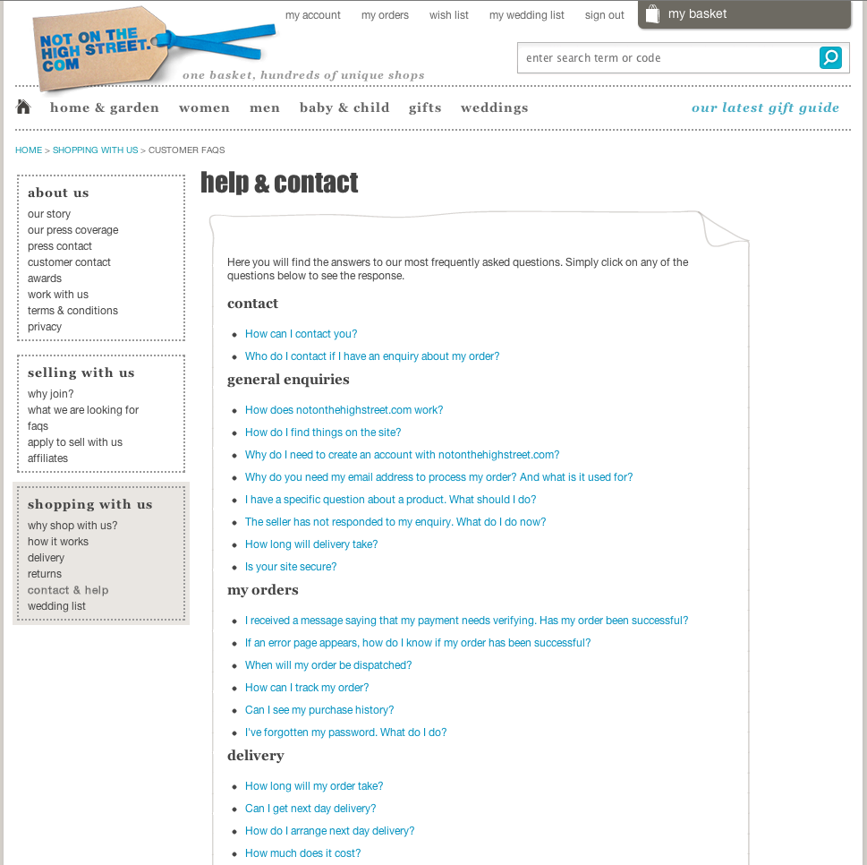

<!SLIDE title-slide>
.notes run through what im going to talk about

# Introduction #

!SLIDE full-page transition=scrollUp
.notes show page in browser

!SLIDE full-page transition=scrollUp
.notes show page in browser

<!SLIDE bullets incremental transition=fade>

# Quick runthrough #

* request comes into notonthehighstreet.com controller
* controller figures out what it needs
* it looks in the database for the content
* we then pass that to the view

!SLIDE commandline incremental

	$ www.notonthehighstreet.com/customer-faqs

!SLIDE smaller
.notes controller

	@@@ ruby
	def customer_faqs
      @page = Page.find_by_handle!('customer-faqs')
	end

!SLIDE full-page transition=scrollUp
.notes database of pages

!SLIDE full-page transition=scrollUp
.notes show page in sublime

!SLIDE full-page transition=scrollUp
.notes show page in browser

