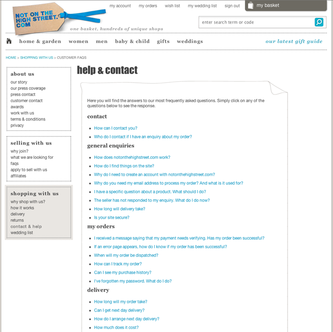

<!SLIDE title-slide>
.notes first slide

# Introduction #

<!SLIDE bullets incremental transition=fade>
.notes something something something something something something something something something something something something something something something dark side

# Quick runthrough #

* request comes into notonthehighstreet.com controller
* controller figures out what it needs
* it looks in the database for the content
* we then pass that to the view
 
!SLIDE commandline incremental

	$ www.notonthehighstreet.com/customer-faqs

!SLIDE smaller
	
	@@@ ruby	
	def customer_faqs
      @page = Page.find_by_handle!('customer-faqs')
	end

!SLIDE full-page transition=scrollUp
.notes another dark side

!SLIDE full-page transition=scrollUp
.notes another dark side

!SLIDE full-page transition=scrollUp
.notes another dark side

