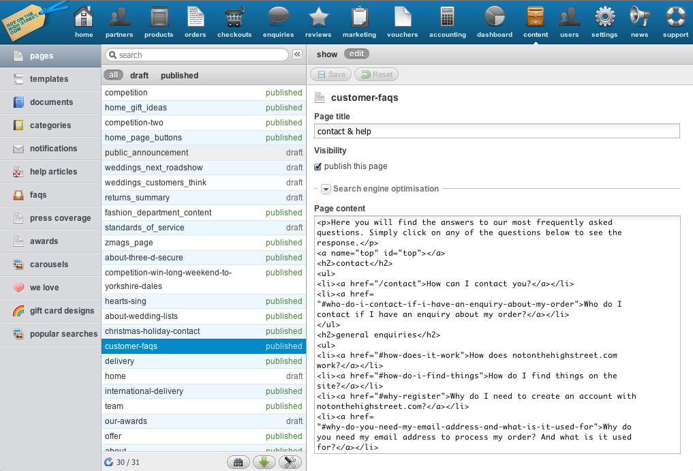
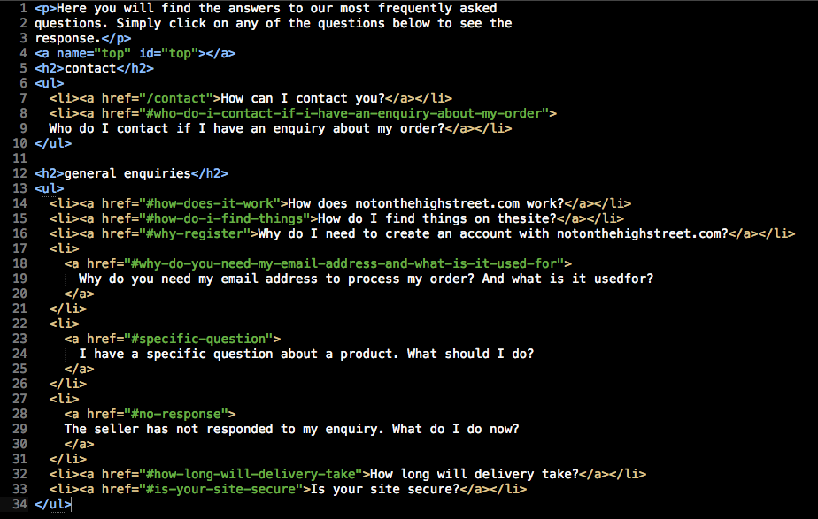

#So how can we edit that?#

!SLIDE commandline incremental

	$ https://noths.notonthehighstreet.com/admin/

!SLIDE full-page transition=scrollUp
.notes another dark side

<!SLIDE bullets incremental transition=fade>
# Programs you can use: #

* notepad++ (http://notepad-plus-plus.org/download/v5.9.3.html)
* sublime text 2 (http://www.sublimetext.com/2)

!SLIDE full-page transition=scrollUp

!SLIDE smaller

	@@@ HTML
	
content goes here

	
and more down here

# content goes here
# and more down here

!SLIDE smaller

	@@@ HTML
	<ul>
		<li>content goes here</li>
		<li>and more down here</li>
	</ul>

* content goes here
* and more down here

!SLIDE smaller
# A few more #

	@@@ HTML
	<a href="www.noths.com">Click here</a>
	<strong>defines bold text</strong> (<b></b>)
	<i>defines italic text</i>
	<h1>Header with <b>bold</b> text</h1>

!SLIDE full-page transition=scrollUp
.notes exceptions

# exceptions #

	@@@ HTML
	
	 
	

!SLIDE full-page transition=scrollUp
.notes another dark side

